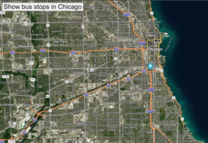

 <h3>Chicago Bus Tracker</h3> 
 

</body>

<H1>Description:</H1>
The project was designed to show various bus stop locations in Chicago when users click on the button to activate the function that moves the location marker.
I changed the map style to satellite-streets-v11 because it provides users with a realistic view of the city and a better view of where places are located. I also placed coordinates of various bus stops in Chicago in the bus stop array. 
 

<H1>License information:</H1> 
MIT license. Open source.
